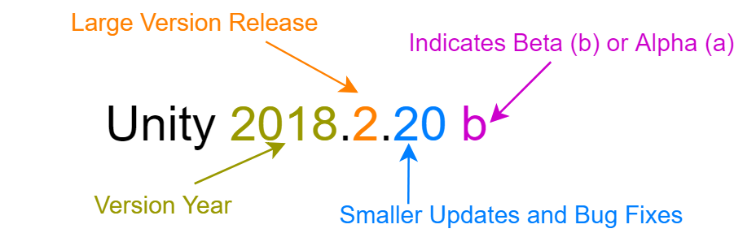

# vrcapstone20sp-team3
Team Repository for CSE 481v - VR Capstone @ University of Washington

## Using Git With Unity

When collaborating on large projects in Unity, having a method of version control is essential: this is why we use Git. Git allows us to save versions of our project as we work on it so that we still have the ability to go back to old versions if we need to.

### Best Collaboration Techniques

Collaborating with Git and Unity can be difficult, so we will provide you with the general best practices for doing so. Please make sure to read through everything and make sure that you have access to your team's git repo.

#### Version is Important!

Unity is in a constant development cycle, which means that new versions are released periodically throughout the year. This means that the way the software works can change slightly, and therefore the version of the project is very important to making sure your project works.

You can breakdown the Unity Version as follows:



When you start a development cycle of your project, you should pick a year and large version release. For the smoothest development it is recommended that you stick to the same year and large version, but in reality most projects do end up upgrading to new major releases throughout their development cycle, especially multi year projects. Throughout the development cycle, Unity will probably release smaller updates and bug fixes as well. It is ok to install smaller updates, so long as you maintain the same year and large release, at least until you decide to upgrade to a new major release. Usually you should not work in the Alpha or Beta versions because they are not stable releases. If your Unity Version has an a or b at the end, you should follow the downgrading your unity project tutorial, and change to the latest stable build.

Unity is for the most part not backwards-compatible. For each version, you can check the release notes on Unity’s website which will list features that will break when you upgrade to newer projects. This means that newer versions of Unity can open projects from an older version. However older versions of Unity can not safely open projects from a newer version (although it is possible, the behavior is undefined and your project will most likely break).

If you open a project from an old version in a newer version of Unity, then it will convert that project to the newer version. This may result in some minor bugs, but for the most part it should be safe. Note: If you convert a project to a newer Unity version, you will not be able to safely load it back into the older Unity version. If you accidentally open up a project in the wrong newer version, you can follow the Downgrading your Unity Project tutorial.

Be sure to always communicate with your team to use a consistent version. If you decide to make an upgrade, make sure to do it as a team.

#### Avoid Merging Unity Scenes
Merging unity scenes is not as simple as merging code. Merging scenes is a very difficult process, and if not done carefully, can easily override important work that you or your teammates may have done. In order to avoid this you should follow these tips:

- Communicate: The best way to avoid merge conflicts in scenes is to tell your teammates that you plan to work on that scene and that they should not touch it until you are done. One method used in traditional animation is to have a "Shot Sheet" or a spread sheet with each scene that you are using. When you need to work on something, you can "check out" a scene by marking it on the spreadsheet.Once you are done, commit your changes and mark the scene as "Open" again.

  Alternatively you could create a trello board to keep track of scenes and tasks that must be finished. You can then put the scenes that are in use in the in-progress column of your board.
- Create Test Scenes: If you are working on a feature that may not need to be integrated with everything else yet, you can create a separate scene that you can use as a blank sandbox to test your scene. If your scene does need to be integrated, you can make a copy of your main scene and use that as a test environment before adding to the main working scene
- Load Multiple Scenes into One: You can break your production up into multiple scenes by the specific areas of the pipeline. For example, the world builder may needto make a change to the set, but you have to make a change to some animations that are in the same scene. What you can do is create a two separate scenes, one specifically for characters,and another for the set. If you need to make your animation changes, you can open up the "Characters" scene, and then drag and drop the "Set" scene into the project hierarchy.Now the set scene is loaded as well, so you can make animation changes for the characters and see where they are on the set. Note: make sure that you do not edit any parts of the set because you could potentially override.
 Scenes can be broken down into:
  * Set
  * Lighting
  * Characters
  * Camera Rigs
  * Code and Feature Tests

- Create a Prefab in another scene: Prefabs are groupings of game objects that are all saved and packaged together. For instance, if you set up a floor and two walls to make a hallway, you can group these into a prefabso that you you can access it in your project tab from any other scenes. This way if you make changes to one prefab, you can apply them to all of them. Say you wanted to setup this hallway whilesomeone else was working in the Set scene,you could open a new scene and create this prefab.
- Copy and Paste From another Scene: Some systems or tasks are self contained and are not initially dependent on other parts of the project. This especially useful if you have to have to import and configure or test your assets. 
  For instance, if you have to assemble the animator and test the animations for a character, you don't need the fully built set, a simple plane will do.You can instead put it together in a test scene and where you can safely import and test animations, and when you have it all setup can move it to a different scene.This is slightly similar to prefabs, but is better if you only have once scene that you need to use this system in or if it was too large and some parts may not create a logical grouping.
- Export Assets as a Package: Unity allows you to export assets that you have assembled in Unity as an Asset Package. This can be especially useful for items that can be setup withoutthe options in another scene. Similar to the animator example, you could instead choose to export a package. However, packages work best when dealing with multiple Unity Projects as opposed to multiple scenes.One common example is say there was a communication issue and two people have both done substantial work on the same scene. They have both committed changes locally, but one person has pushed to the repo and the other person has to merge.Because merging scenes is extremely difficult the traditional git way, the person who has to merge can export their un-pushed work by creating a prefab and adding a package with the changes they have made.They can then import the changes as a package into the master project that the other person was working on, and implement their own changes as well.


### Git: A Brief Overview

When we use Git, your project will live in a repository, or folder, on GitHub. Git allows you to create a local copy of this repository that is connected to the version on GitHub. You can **pull** a the current version from GitHub to your local machine so that you may make changes to it. When you edit the file in the repo on your local machine, you can safely edit them without changing the files on GitHub. When you have finished editing your files, you can safely **commit** the changes with a message explaining what you did. Once you have committed the files, you can then **push** them to GitHub where they will be stored.

### Installing Git

In order to use git we must install it first. If you already have it you may skip this step.
Download the Installer for the system that you are using.
 - Mac OS: https://git-scm.com/download/mac
 - Windows: https://git-scm.com/download/win

This tutorial will cover using a command-line interface, or a GUI interface so you may choose whichever you are more comfortable with. If you wish to use a GUI you should download GitHub Desktop here:
 - https://desktop.github.com/

Because Git limits the size of the files you can save, you will also need to install **Git LFS**(Large File Storage).Download it here: https://git-lfs.github.com/

Then you will need to use the Command Line:
 - Mac: Open up a terminal window
 - Windows: Open up GitBash

Then run the command:
```sh
    git lfs install
```

### Cloning the Repo

If you are using GitHub Desktop you can clone it using **File -> Clone Repository**, and click the **URL** tab. Copy the URL from GitHub in the top right corner, and paste it into the URL link. You will have to choose where to store the repo on your machine in the **Local Path** field. Once everything is set hit **Clone**.

If you are using Command Line:
 - Mac: Open up a terminal window
 - Windows: Open up GitBash

You will need to navigate to the directory that you want to store your repo in. Then you can clone your repo using the following commands:

 ```sh
    cd replace_this/with_path_to/your_directory
    git clone your_repo_name
 ```

### Making Changes To Your Repo

Before working on any changes, you should always **pull** to make sure that your code is up to date. Once you have made your changes you need to **add** them to staged changes. You can also **remove** files that you don't wish to track. You can see which files have been added by checking the **status**. Once you have added, you need to **commit** and provide a summary of the changes. Once you have committed, you can **push**.

To use all of these commands:

|Command   | GitHub Desktop                              | Command Line            |
|----------|---------------------------------------------|-------------------------|
|Pull      | Repository -> Pull                          | git pull                |
|Add       | Done Automatically, check box on left side  | git add file.filetype   |
|Remove    | Uncheck box on left side                    | git rm file.filetype    |
|Status    | Displayed on left                           | git status              |
|Commit    | Bottom Left Corner, add summary, hit commit | git commit -m "Summary" |
|Push      | Repository -> Push                          | git push                |

### Merge Conflicts

Sometimes your attempt to push new changes may fail. This is usually because you don't have the most up-to-date files, most-likely because another person has pushed their changes before you have pushed yours. This is usually an easy fix. If someone has added or changed different files than the ones you have been working on, you can usually simply just **pull** from GitHub.

If you were working on the same file as someone else, then you have a **Merge Conflict**. To resolve this, you will need to go into the file that is conflictied. Git will have highlighted the spots where differences exist. You should go through and choose the changes that you would like to keep.

Once you have made the changes, on desktop you can use  **Branch -> Merge into current branch...**.
Using command line:
```sh
    git merge origin/yourBranchName
```

### Branching

If you need to work on something separately from somone else without worrying about merge-conflicts, you can create a **branch**. For this quarter, you will be creating your own branch to work in.

To do so in Desktop find the tab at the top labeled **Branch -> New Branch...**. Name your new branch with your name for the purpose of this class. Then hit **Create Branch**.

Using the command line, to create and switch to a new branch you can enter the following command:
```sh
    git checkout -b yourNameHere
```

From now on you should work in this branch only. Before editing your files and commiting, make sure you are working in your branch.

### Updating From Master Branch

For your assignments we will add new files every week, which will require you to get these new files from the master branch. From your branch you can get files using GitHub Desktop by going to **Branch -> Update from default branch**.

Using command line you can use the command:
```sh
    git checkout yourBranchName
    git pull origin master
```
